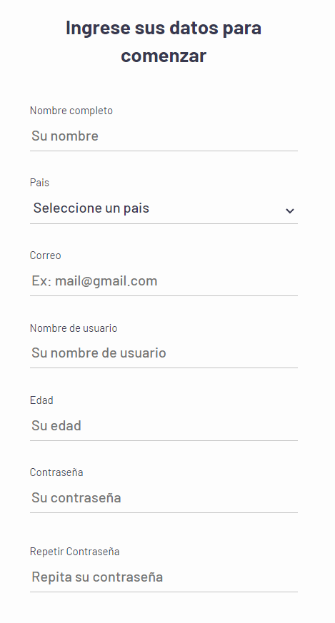
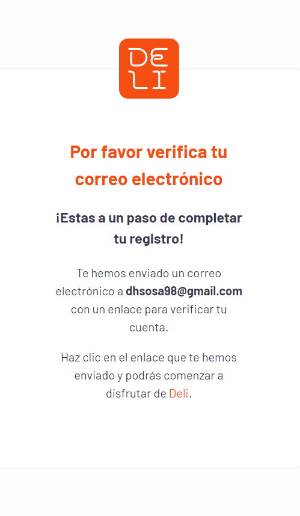
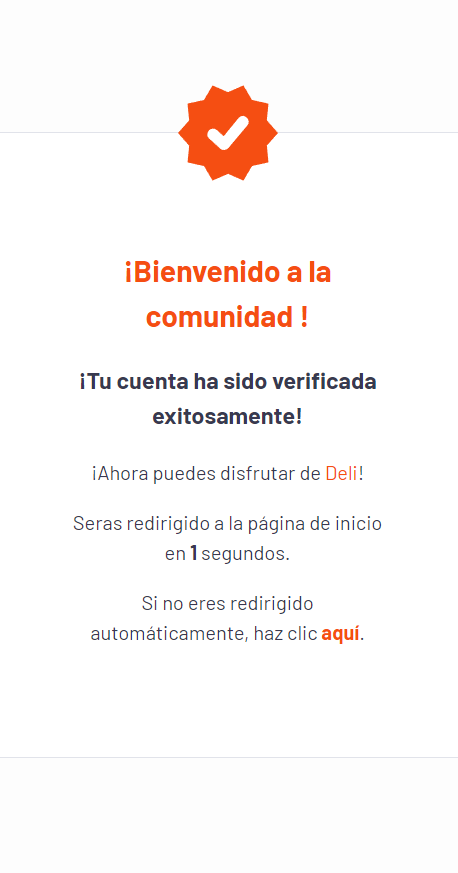

# DELI APP Challenge

## Description

This is a simple app that allows users to add, edit, and delete items from a deli menu. The app is built using React and Redux.

## Installation

1. Clone the repository

2. You need to set the environment variables in a .env file. You can use the .env.example file as a guide.

### backend

```bash
PORT= # Port for the server
MAILGUN_API_KEY= # Mailgun API key for sending emails (Optional you also can use a SMTP server)
MAILGUN_DOMAIN= # Mailgun domain for sending emails (Optional you also can use a SMTP server)
SECRET_KEY= # Secret key for Auth token

# SMTP server
EMAIL_USER= # Email user for sending emails
EMAIL_PASSWORD= # Email password for sending emails
EMAIL_HOST= # Email host for sending emails
EMAIL_SERVICE= # Email service for sending emails

# Database
DB_TYPE= # Database type | mysql, postgres, sqlite, etc
DB_HOST= # Database host
DB_PORT= # Database port
DB_USERNAME= # Database username
DB_PASSWORD= # Database password
DB_DATABASE= # Database name

FRONTEND_URI= # Frontend URI for communication with the frontend
BASE_URI= # Base URI for the server
CORS_ORIGIN= # CORS origin for the server, also can be the frontend URI
```

### frontend

```bash
VITE_API_URL= # API URL of the server
```

3. Install the dependencies

### backend

```bash
cd backend && npm install
```

### frontend
```bash
cd frontend && npm install
```

4. Run the server

### backend

```bash
npm run dev
```

### frontend
```bash
npm run dev
```

Note: Before running the server, you need to create the database and run the migrations.

the file it's in the backend folder, in the migrations folder.

### With docker

You can also run the app using docker-compose. Go to the docker folder and run the following command:

```bash
docker-compose up
```

Note: Dont forget to set the environment variables in the .env files and run the migrations.

## Run migration with docker

```bash
docker exec -it deli-db psql -U root -d deli-db -f /docker-entrypoint-initdb.d/initDb.sql
```

## Screenshots

### Sign Up


### Verifying email


### Email Verified


## Live Demo
[Live Demo](https://deli-app-one.vercel.app/)

